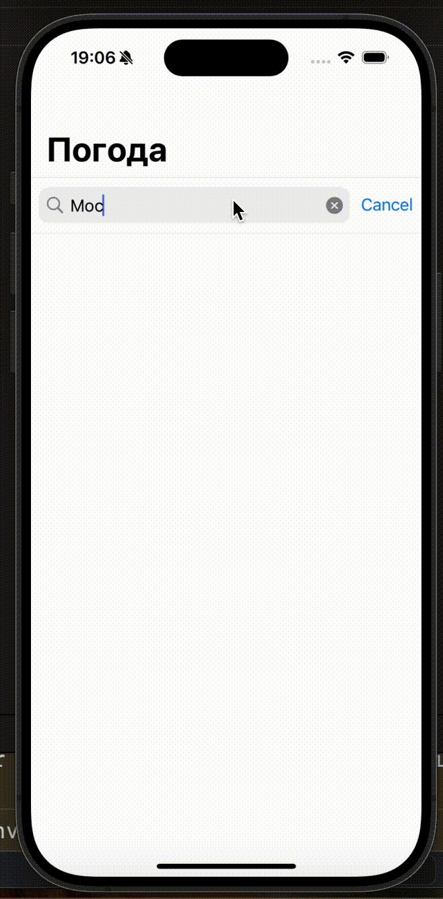
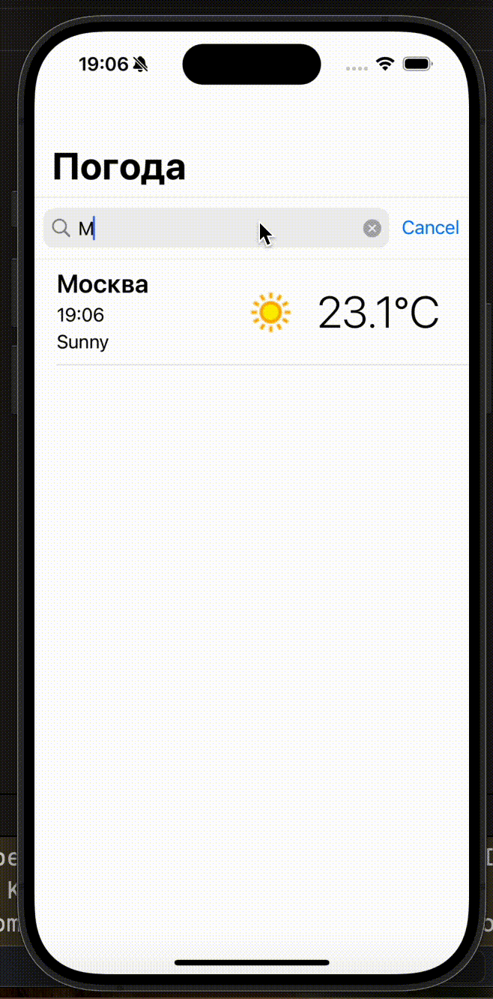
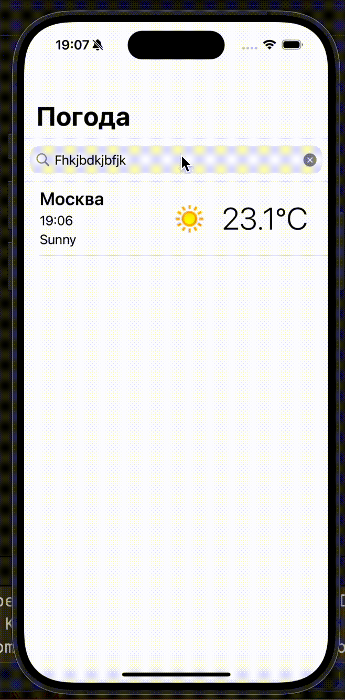

# Weather App – Тестовое задание iOS на стажировку в Касперский

Приложение показывает текущую погоду в городах. Данные берутся с [WeatherAPI.com](https://www.weatherapi.com/). Используется UIKit и архитектура MVC. Список городов сохраняется локально, используется `UserDefaults`.

## 📱 Функциональность

- Поиск города
- Отображение текущей погоды: температура, иконка, локальное время с обновлением в реальном времени (реализовано с помощью часовых поясов) 
- История поисков с сохранением в память устройства
- Обработка ошибок: город не найден, повторный поиск

## 🛠 Стек

- UIKit + Storyboard
- MVC
- URLSession для сетевых запросов
- SDWebImage для загрузки иконок
- UserDefaults
- AutoLayout
- Работа с фоновыми потоками через DispatchQueue

## 🎥 Демонстрация

### Ввод города

### Проверка на повтор

### Город не найден

## 👨‍💻 Автор

Тестовое выполнено в рамках подготовки к стажировке в Kaspersky.  Разработчик: Лилия Чечина, tg: @flowers_queen 🧏🏼‍♀️

---
